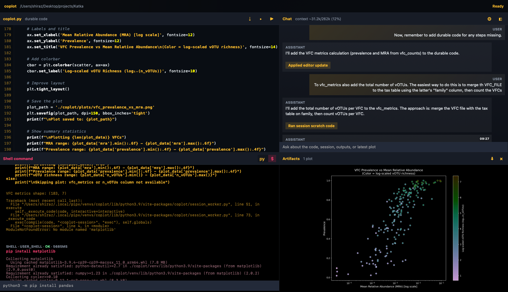
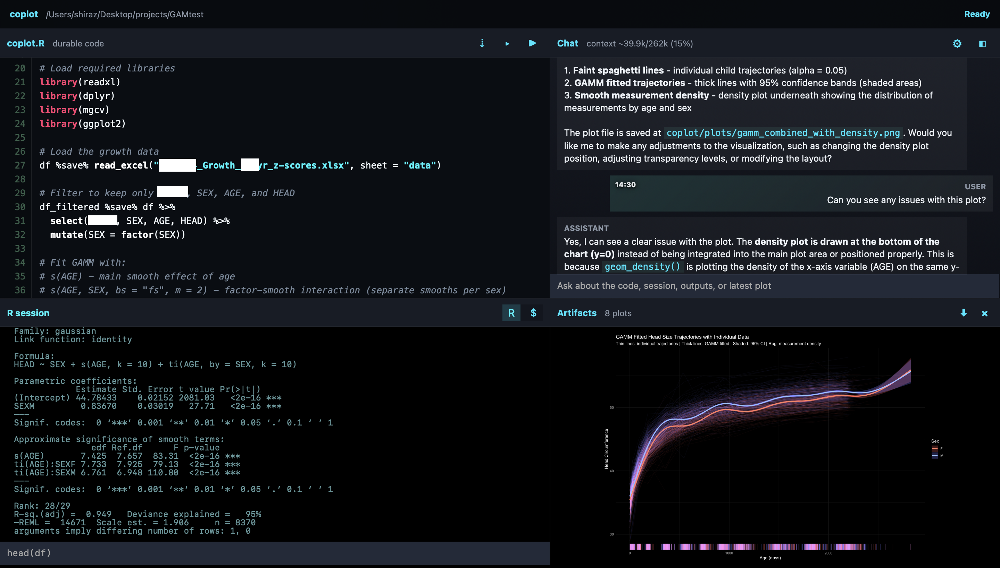

# coplot

Coplot is a **local first** AI workspace for data scientists that need to keep sensitive data on their own machine. No API keys. No cloud models. Coplot plugs into vLLM and Ollama instead.

Open source multimodal models Like Gemma 4 and Qwen 3.6 are strong enough for real analytical work and tool use. The missing piece is the interface. Coding-agents like OpenCode or OpenClaw are a poor fit because they work with files and URLs, not **data frames** and **plots**.

`coplot` fills that gap. It gives you a familiar notebook/RStudio-like workspace with a chat beside your code, live Python or R execution, and the LLM **sees your plots** live. Just give it an Ollama or vLLM endpoint URL and you can start data wrangling.
## Live Sessions

### Python



### R



## Install

During development:

```bash
python3 -m pip install -e .
```

From GitHub as an app:

```bash
pipx install git+https://github.com/yourname/coplot.git
```

## Run

Point coplot at a workspace folder containing the data you want to analyze:

```bash
coplot ~/projects/project_name
```

Or cd into your project folder first and then just run:
```bash
coplot
```

Alternatively, if the `coplot` command doesn't work:

```bash
python3 -m coplot ~/projects/project_name
```

This will open a browser at the URL:

```text
http://localhost:8765
```
On another machine on the same LAN, replace `localhost` with the machine's local IP address.

## Settings
On the first run, the model settings dialogue opens:
- Choose between R or Python
- Disable reasoning for faster responses. Enabling reasoning is not worth it.
- ~30b Qwen 3.6 and Gemma 4 models work well
- smaller models mess up the tool calls that `coplot` requires to function
- Minimum usable context size: 16,384

## Workspace shape
The app creates local workspace files in your project folder. Dependencies are project-specific with `venv` or `renv`.
- `coplot.py` or `coplot.R` - your data analysis code
- `coplot/` - contains the virtual environment, chat transcript and model settings
- `coplot/plots/` - plots that the model can see
- `coplot/chat_images/` - pasted PNGs attached to chat turns

# Working with `coplot`
- The LLM sees your code, Python/R and Shell output and your last plot
- The LLM often prefers one-off code execution in the terminal instead of editing and running
- Ask it to "remember to update the code" to make it add reproducible to `coplot.R or py`
- Paste screenshots into the chat to reproduce a plot you've seen elsewhere
- The LLM can act independently for max three turns before user input is a must
- Just say "proceed" if it wasn't finished with what it was doing
- LLM responses can get slow when the context counter is +32k. Compact context often using top right button
- `coplot` is best for exploration. It does not have the bells and whistles of a daily driver code-editor
- Once you're happy with `coplot`'s result, copy the code to Rstudio or Jupyter and continue there

## Project Shape
The current app is intentionally dependency-light:
- Python standard library HTTP server
- Vanilla HTML, CSS, and JavaScript frontend
- A startup language switch that defaults to R and locks each workspace to Python or R
- Python workspaces use `coplot.py` and a workspace-local `coplot/venv/`
- R workspaces use `coplot.R`, `coplot/renv/`. R mode packages `jsonlite` and `renv` installed
- `coplot/server.py` serves the app, persists local state, calls an OpenAI-compatible chat endpoint, and executes agent actions.
- `coplot/session_worker.py` runs the persistent Python session inside the workspace `coplot/venv/`.
- `coplot/r_session_worker.R` runs the persistent R session with `coplot/renv/` activation.
- `coplot/static/` contains the browser UI.
- `web-interface-spec.md` captures the product direction.
- `HANDOFF.md` captures the current implementation state and known rough edges.
