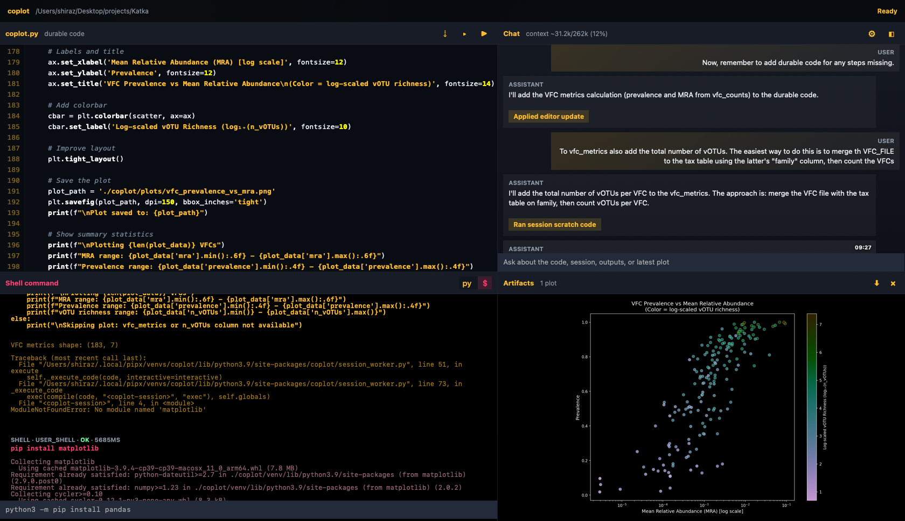
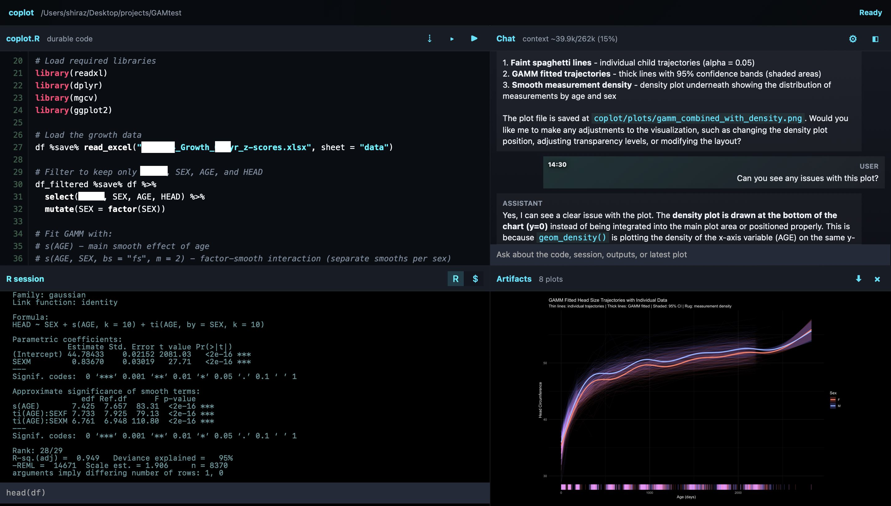

# coplot

Coplot is a **local first** AI workspace for data scientists that need to keep sensitive data on their own machine. No API keys. No cloud models. Coplot plugs into vLLM, llama.cpp or Ollama instead.

Open source multimodal models Like Gemma 4 and Qwen 3.6 are strong enough for real analytical work and tool use. The missing piece is the interface. Coding-agents like OpenCode or OpenClaw are a poor fit because they work with files and URLs, not **data frames** and **plots**.

`coplot` fills that gap. It gives you a familiar notebook/RStudio-like workspace with a chat beside your code, live Python or R execution, and the LLM **sees your plots** live. Just give it an Ollama or vLLM endpoint URL and you can start data wrangling.


## Live Sessions

### Python



### R



## Install

### 1. Install prerequisites

Coplot needs `venv` and `renv` to work.

Python on Mac and Windows already come with `venv`. On Debian/Ubuntu, install `venv` as follows.
```bash
sudo apt install python3-venv
```

As for R, install `renv` and `jsonlite` like this, before installing Coplot:
```bash
Rscript -e "install.packages(c('renv', 'jsonlite'))"
```

### 2. Install `pipx`

Coplot is easiest to install with `pipx`. Install `pipx` as follows:


```bash
python3 -m pip install pipx
python3 -m pipx ensurepath
```

Then close and reopen your terminal, and:

### 3. Install Coplot

```bash
pipx install git+https://github.com/shiraz-shah/coplot.git
```

If you already installed Coplot and want the latest version:

```bash
pipx upgrade coplot
```

## Run Coplot
Point coplot at a workspace folder containing the data you want to analyze:

```bash
coplot ~/projects/project_name
```

Or cd into your project folder first and then just run:
```bash
coplot
```

Alternatively, if the `coplot` command doesn't work:

```bash
python3 -m coplot ~/projects/project_name
```
or
```bash
cd ~/projects/project_name
python3 -m coplot
```

This will open a browser at the URL:

```text
http://localhost:8765
```
On another machine on the same LAN, replace `localhost` with the machine's local IP address.

## Settings
On the first run, the model settings dialogue opens:
- Choose between R or Python
- Enter endpoint URL and click "connect"
- Select model from dropdown
- Disable reasoning for faster responses. Enabling reasoning is not worth it.
- ~30b Qwen 3.6 and Gemma 4 models work well
- smaller models mess up the tool calls that `coplot` requires to function
- Minimum usable context size: 16,384

## Working with `coplot`
- The LLM sees your code, Python/R and Shell output and you can tell it to "look at the plot" too
- The LLM often prefers one-off code execution in the terminal instead of editing and running code file
- Ask it to "remember to update the code" to make it add reproducible to `coplot.R` or `.py`
- Paste screenshots into the chat and ask it to reproduce a plot you've seen elsewhere
- The LLM can act independently for max four turns before user input is a must
- Just say "proceed" if it wasn't finished with what it was doing
- LLM responses can get slow when the context counter is +32k. Compact context often using top right button
- `coplot` is best for exploration. It does not have the bells and whistles of a daily driver IDE
- Once you're happy with `coplot`'s result, copy the code to Rstudio or Jupyter and continue there
- Click the clear and archive button to archive your session into a zip and start fresh

## Workspace shape
The app creates local workspace files in your project folder. Dependencies are project-specific with `venv` or `renv`.
- `coplot.py` or `coplot.R` - your data analysis code
- `coplot/` - contains the virtual environment, chat transcript and model settings
- `coplot/plots/` - plots that the model can see
- `coplot/chat_images/` - pasted PNGs attached to chat turn
- `coplot/chat_images/venv` or `renv` - holds project dependencies
- `coplot_YYYYMMDD-HHMMSS.zip` - session archives that contain all of the above except the dependencies.

## Model serving for prompt caching
Coplot sends the stable parts of the prompt first so local inference servers can reuse cached prompt/KV state across chat turns. Good server settings matter a lot for long sessions.

- vLLM
  - Start with `--enable-prefix-caching` explicitly, even if your vLLM version enables it by default.
  - Give the KV cache enough room with `--gpu-memory-utilization`, e.g. `0.90` or higher if your GPU has headroom.
  - Enable/inspect metrics and watch prefix cache hit/query counters if performance is unclear.
  - Example:
    ```bash
    vllm serve Qwen/Qwen3.6-30B-A3B \
      --host 0.0.0.0 \
      --port 8000 \
      --enable-prefix-caching \
      --gpu-memory-utilization 0.90
    ```

- llama.cpp
  - Prompt caching is enabled by default, but `--cache-prompt` makes the intention explicit.
  - Coplot pins llama.cpp requests to `id_slot: 0`, so avoid sharing slot 0 with other clients. For a dedicated Coplot server, `-np 1` is simplest.
  - If using multiple slots, e.g. `-np 2`, make sure slot 0 is available for Coplot.
  - Keep enough RAM prompt cache. Use `--cache-ram 32768` or `--cache-ram -1` for testing. Do not use `--cache-ram 0`.
  - For long contexts, raise context checkpoints. `--ctx-checkpoints 128` is a good starting point.
  - If logs say `making room for prompt cache entry`, raise `--cache-ram`. If logs say `cache token limit ... reached`, raise `--ctx-checkpoints`.
  - Example:
    ```bash
    llama-server \
      -m /path/to/model.gguf \
      --host 0.0.0.0 \
      --port 8000 \
      -np 1 \
      --ctx-size 65536 \
      --cache-prompt \
      --cache-ram 32768 \
      --ctx-checkpoints 128 \
      --metrics
    ```

- Ollama
  - Ollama is the easiest backend to run, but it exposes fewer prompt-cache controls than vLLM or llama.cpp.
  - Use a large enough context length for Coplot sessions, e.g. `OLLAMA_CONTEXT_LENGTH=64000`.
  - Keep the model loaded between turns with `OLLAMA_KEEP_ALIVE=-1` or a long duration.
  - For best long-context prompt-cache tuning, prefer vLLM or llama.cpp.
  - Example:
    ```bash
    OLLAMA_CONTEXT_LENGTH=64000 OLLAMA_KEEP_ALIVE=-1 ollama serve
    ```

## Project Shape
The current app is intentionally dependency-light:
- Python standard library HTTP server
- Vanilla HTML, CSS, and JavaScript frontend
- A startup language switch that defaults to R and locks each workspace to Python or R
- Python workspaces use `coplot.py` and a workspace-local `coplot/venv/`
- R workspaces use `coplot.R`, `coplot/renv/`. R mode packages `jsonlite` and `renv` installed
- `coplot/server.py` serves the app, persists local state, calls an OpenAI-compatible chat endpoint, and executes agent actions.
- `coplot/session_worker.py` runs the persistent Python session inside the workspace `coplot/venv/`.
- `coplot/r_session_worker.R` runs the persistent R session with `coplot/renv/` activation.
- `coplot/static/` contains the browser UI.
- `web-interface-spec.md` captures the product direction.
- `HANDOFF.md` captures the current implementation state and known rough edges.
